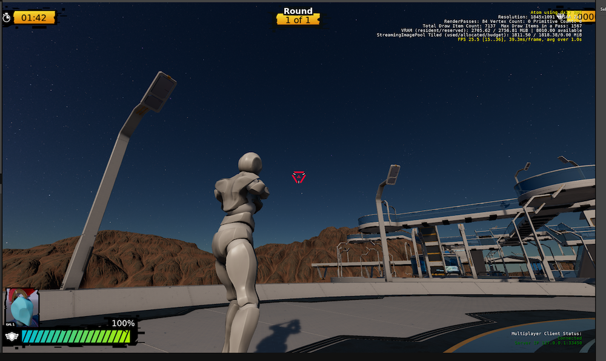

## Meeting Details

- **Date/Time:** [Jan 17th, 2023 @ 17:00pm UTC / 11:00am ET / 9:00am PT](https://lists.o3de.org/g/o3de-calendar/viewevent?repeatid=39350&eventid=1573469&calstart=2023-01-17)
- **Location:** [Discord SIG-Network Voice Room](https://discord.gg/62nq7HP5mP)
- **Moderator:** Pip Potter (lmbr-pip)
- **Note Taker** Pip Potter (lmbr-pip)

[Agenda Issue](https://github.com/o3de/sig-network/issues/88)

## SIG Updates

### General SIG announcements
SIG/Network needs to run elections in January. [Allisaurus](https://github.com/allisaurus) has volunteered to be election coordinator. Aim to have new SIG Chair(s) in place for Feb meeting. All are welcome to step forward to take on SIG chair(s).
* Election guide for all SIGs: https://github.com/o3de/community/blob/main/O3DE%20Elections/O3DE%20Elections%20Guide.md

### Multiplayer Sample updates

* Have switched to new Y-bot character supplied by Adobe
* New level has been created to create more space for player vs player encounters
* Aim to be complete for play testing by end of January
* Working with LF to define game name, but game still planned for delivery to [o3de-multiplayersample](https://github.com/o3de/o3de-multiplayersample) repo.

### Networking Updates
* [Client/server](https://github.com/o3de/sig-network/blob/main/rfcs/rfc-net-20221020-1-clientserver.md) split is now live in dev branch of o3de/o3de.
* Network Version mismatch work was completed: https://github.com/o3de/o3de/pull/13103
* New simple player spawner is available: https://github.com/o3de/o3de/pull/13871
* Editor tests returned to AR: https://github.com/o3de/o3de/pull/13648
* Server disconnection messaging added when using auto close (sv_terminateOnPlayerExit): https://github.com/o3de/o3de/pull/13484 
* Optimized network entity updates: https://github.com/o3de/o3de/pull/13282

Pending changes include [OnNetworkActivate changes](https://github.com/o3de/o3de/pull/13850) to provide a place for network entities to network is available and [Component Gem template](https://github.com/o3de/o3de/pull/13655) to use command line to turn any game project into a multiplayer project.

### Cloud Services
* Updating the [AWS Cloud Development Kit](https://aws.amazon.com/cdk/) version CDKv2 for all projects/Gems that use it. 
    * Impactful change notice was delayed aim for submission week of Jan 23rd now 

## Meeting Agenda

### GameNetworkingSockets
Discussed https://github.com/ValveSoftware/GameNetworkingSockets
* Value for O3DE would be P2P and NAT punchthrough but this is appears to be networking layer out of source engine and lacks modularity to just pick features without a lot of work.
* Some overlap with what we have, hard to incorporate just the pieces
* We could incorporate the APIs but provide our implementation behind ie NAT Punchthrough so it felt consistent.
* Unclear if library supports all platforms O3DE targets, focus seems primarily on Windows and Linux.
* Note: Library is separate from Steamworks SDK which provides steam integration, anti-cheat which needs to built into your build process etc.
* At this point in time we do not have compelling reason or sponsor of work. If a member of SIG/Network has a passion for driving this change, then please start with RFC proposing how library could be incorporated.

### SIG Roadmap - To Add
* [lz4](https://github.com/o3de/o3de/issues/9007) lib used by multiplayer compression gem requires security patching should be added to SIG roadmap (aim to complete by March)
* Amazon GameLift gem refresh with MPS is also planned for delivery by end of March

### SIG Roadmap - In Planning
* Multiprocess / build size
* Asset Packaging for server
* AWS Gems relocation is still planned, need to incorporate learnings from o3de-extras split into gem migration plan (https://github.com/o3de/sig-network/blob/main/rfcs/rfc-net-20220719-1-awsgems.md)
* AWS C++ SDK Refresh
   
## Open Discussion Items
None

## Action Items
Carried from [previous meeting](https://github.com/o3de/sig-network/blob/main/meetings/notes/sig-meeting-20220719.md):
* _TODO_: Need to decide on SIG/network's responsibility towards cloud service gems once they migrate from O3DE/O3DE (may require charter update).
* _COMPLETED_: Find volunteer to run SIG/Network Chair elections