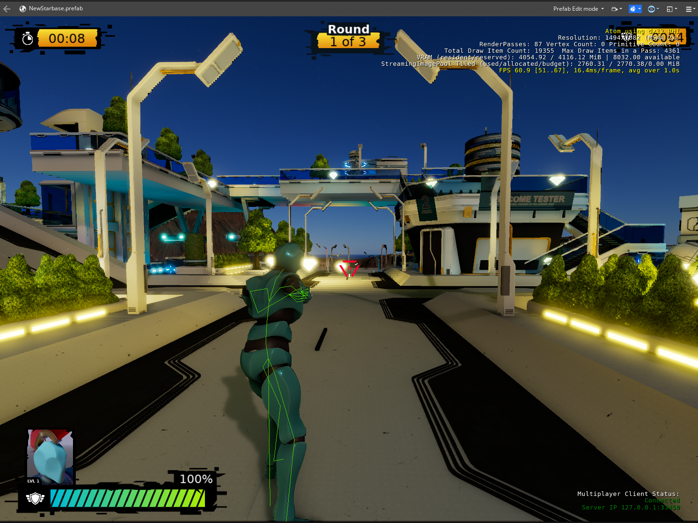

## Meeting Details

- **Date/Time:** [Feb 21 2023 @ 17:00pm UTC / 11:00am ET / 9:00am PT](https://lists.o3de.org/g/o3de-calendar/viewevent?repeatid=39350&eventid=1573469&calstart=2023-02-21)
- **Location:** [Discord SIG-Network Voice Room](https://discord.gg/62nq7HP5mP)
- **Moderator:** Pip Potter (lmbr-pip)
- **Note Taker** Pip Potter (lmbr-pip)

[Agenda Issue](https://github.com/o3de/sig-network/issues/92)

## SIG Updates

### General SIG announcements
* SIG elections held, current chair (lmbr-pip) and co-chair (kberg-amzn) re-elected
* Wanted to call out community members Gene (Gene \[Amazon\]) and Olex (Olex \[Amazon\]) for all their help on Discord with spawning and server launching issues, in sig-network text channel.

### Multiplayer Sample updates

* New lighting pass
* Lots of character updates
* Fixes to client/server stability
* Focus is ensuring PvP is responsive and functional.
* Followup with Royal about build/access as he's interested in early access.
* Expect to contribute new sample in March to o3de/o3de-multiplayersample

### Networking Updates
* Added network component icons and missing tooltips
* Fixes for array/vector serialization
* Lots of cvar, cfg and setreg changes
* Added new player id debug component

### Cloud Services

## Meeting Agenda
Discussed MPS play test scaler: https://github.com/aws-samples/scaletest-o3de-multiplayer-sample
* Followup from O3DCon 2022 talk: https://www.youtube.com/watch?v=QayMbJxOzJ0&list=PLCQwFpnHSZQgzCpMmbxruFkWr3d73ZfEJ&index=17 
* Now been fully open source
* Have a project board to talk to progress
* Open to contributions, see the contributions guide
* Owned by AWS and not O3DE, so SIG/Network will be contributing but not owning repository

   
## Open Discussion Items
None

## Action Items
Carried from [previous meeting](https://github.com/o3de/sig-network/blob/main/meetings/notes/sig-meeting-20220719.md):
* _TODO_: Need to decide on SIG/network's responsibility towards cloud service gems once they migrate from O3DE/O3DE (may require charter update).
* _COMPLETED_: Find volunteer to run SIG/Network Chair elections