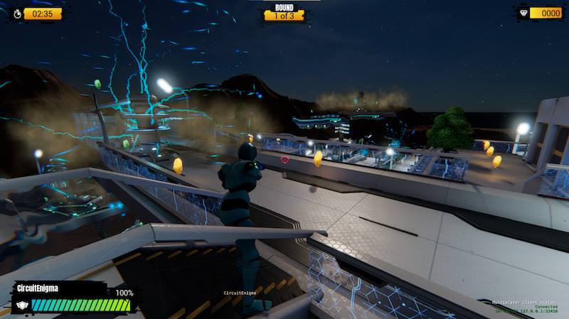

## Meeting Details

- **Date/Time:** [April 18 2023 @ 17:00pm UTC / 11:00am ET / 9:00am PT](https://lists.o3de.org/g/o3de-calendar/viewevent?repeatid=39350&eventid=1573469&calstart=2023-04-18)
- **Location:** [Discord SIG-Network Voice Room](https://discord.gg/62nq7HP5mP)
- **Moderator:** Pip Potter (lmbr-pip)
- **Note Taker** Pip Potter (lmbr-pip)

[Agenda Issue](https://github.com/o3de/sig-network/issues/95)

## SIG Updates

### General SIG announcements
None

### Multiplayer Sample updates

* AP UX changes for launch screen
* Changes batching for particle effects, which ensures particle effects are always visible, regardless of viewing angle
* Graphic setting screen UX to control VRAM usage and other settings.
* Lots of small fixes to gameplay
* Team has no concerns wrt to delivery

### Networking Updates
* Fixes for timeout issues when playing in editor
* Fixed movement issues caused by wrap around issues in buffers.
* Fixed network hit volume issues around creation and tracking
* Featured complete on Multiplayer Sample, only taking blockers or docs update into the `stabilization/2305` branch from April 19th, work will switch to `development` branch.

### Cloud Services
* GameLift out of the box experience MPS being delivered
* Resource mapping tool links fixed

See https://github.com/o3de/o3de/pulls?q=is%3Apr+label%3Asig%2Fnetwork+is%3Aclosed 

## Meeting Agenda
Review state of new [MultiplayerSample game](https://github.com/o3de/o3de-multiplayersample/tree/stabilization/2305)
* See notes above

Review release notes, plans etc around O3DE 2305 release: https://github.com/o3de/sig-release/pull/173
* Shipped release notes

Review roadmap
* One item to add around GameLift out-of-the-box

Request for public engagement around MPS setup - see  https://discord.com/channels/805939474655346758/816043672709103667/1096496623888117790
* Request is to watch setup, demo, focus on gaming - focus on how to bring in new contributors
* Basically, how do newcomers contribute?
* Recommendation: leave stuff for the community todo on the sample. 
     * Note: have large feature request backlog that community can take on: https://github.com/o3de/o3de-multiplayersample/issues?q=is%3Aissue+is%3Aopen+label%3Akind%2Ffeature+
     * Aim is for community to build on the sample, add, extend or change it as needed. 

   
## Open Discussion Items
None

## Action Items
Carried from [previous meeting](https://github.com/o3de/sig-network/blob/main/meetings/notes/sig-meeting-20230117.md):
* _TODO_: Need to decide on SIG/network's responsibility towards cloud service gems once they migrate from O3DE/O3DE (may require charter update).
* _NEW_: Reach out to docs/community team around engagements using MPS, connect them to JT.
* _NEW_: Add GameLift out-of-box feature to public roadmap