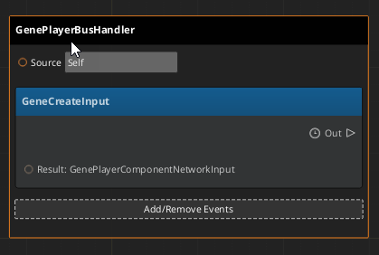
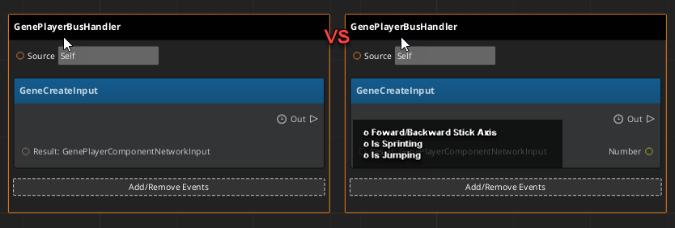
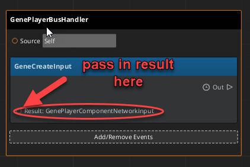
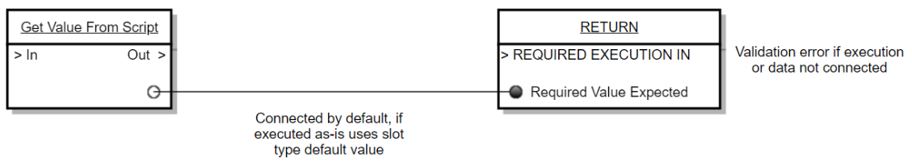

# rfc-net-20211005-1
* Intake issue: https://github.com/o3de/sig-network/issues/6

### Summary:  
A key feature built into Multiplayer Components is the concept of Network Input.  Network Input helps digest player input (the human and therefore most unpredictable aspect of the network simulation), in order to keep the simulation on clients and servers in sync.

Currently, Network Input is only available to developers writing C++ components; this RFC proposes exposing Network Input to script (Lua and Script Canvas).

  

### What is the relevance of this feature?

Scriptable Network Input will help save iteration time and allow developers who have limited experience with networking and C++ to build a multiplayer game.

Since scripting doesn't require C++ knowledge or time to recompile, adjustments to the multiplayer controllers can be iterated upon quickly.  For example, when receiving keyboard WASD controller input, a designer might decide to add an acceleration curve so that tapping the keyboard moves the character less than it would from holding it down.  These types of gameplay edits aren't an exact science and requires dozens of little modification in order to create "good feel".  Without scripting support, a designer hoping to modify how keyboard input affects the character controller will need to (1) modify C++ game logic, (2) close down the Editor and Asset Processor, (3) recompile C++, (4) reopen the Editor, and finally (5) reopen and run the test level in order to see the results of their code.  If each of these small modifications requires C++, then hours are lost over the course of game development due to recompiling and testing code.

If, alternatively, designers can make changes via script then the **time and steps taken are reduced**: (1) modify the game logic script, (2) rerun the level to test the change.

In addition to saving time, scripting is typically easier to learn than C++ and thus is easier for studios to find/maintain a scripting dev.

  

### Feature design description:

Multiplayer auto-components with NetworkInputs will have the option to enable or disable exposing any of their NetworkInputs to script via an "ExposeToScript" flag.  If any NetworkInputs are enabled for scripting, the multiplayer auto-component should generate 2 new methods inside of behavior context. 

The first method will be an event which returns a result called _CreateInput:_

*   Scripters will listen for this _CreateInput_ event in Script Canvas or Lua and return a struct containing the values for each exposed network input.  For example, the network player controller may want the ability to move a player forward and backward using the W and S keys respectively.  The scripter would then listen for the _CreateInput_ callback and return 1.0 if W is currently being pressed, - 1.0 if S is currently pressed, or 0.0 if neither W or S is being pressed.  The networking backend will do the heavy lifting ensuring the input is sent to the authoritative server and making sure_ProcessInput_ is called on the other side.

  

The second method will be an event called _ProcessInput:_

*   Scripters will listen for _ProcessInput_ on the Autonomous player or the Authority in order to read the input and drive the simulation.  Using the last example from _CreateInput_, if _ProcessInput_ says the player's movement is -1.0, then the designer could send a request to the NetworkCharacterController to decrease the player velocity so that they slow down or move backwards. 

  

### Technical design description:

Step 1: Update Auto-Component XML NetworkInputs to Include "ExposeToScript" Attribute

*   MutliplayerComponent XMLs should add a new NetworkInput attribute called "ExposeToscript"
*   Example:  <NetworkInput Type="StickAxis" Name="ForwardAxis" Init="0.0f" "**ExposeToScript"="true"**/>
*   .\\Gems\\Multiplayer\\Code\\Source\\AutoGen\\AutoComponent\_Header.jinja and AutoComponent\_Source.jinja will look for NetworkInputs using the new "ExposeToScript" attribute and expose new Behavior Context methods for the multiplayer component

Step 2: Expose Auto-Component Class {{ ComponentName }}NetworkInput to Behavior Context

*   In order for CreateInput event to return the input and ProcessInput to read the input, the {{ ComponentName }}NetworkInput class will need to be exposed to behavior context
*   Create a ReflectToBehaviorContext() method inside of the  {{ ComponentName }}NetworkInput class and make sure it's called from somewhere (suggestion: the base component's Reflect() method) so it's reflected
*   Loop through each network input and create a behavior context property.  Remember to only expose them if their "ExposeToScript" attribute is true.
*   Create a behavior context constructor so scripters can create/store an instance of the {{ ComponentName }}NetworkInput class
*   Make sure to name all the classes, properties, and constructor parameters so scripter can see what they are editing.  For example, if there's a boolean input called "IsJumping", make sure any Script Canvas nodes referencing "IsJumping" says "IsJumping" instead of displaying the default "boolean"

Step 3: Expose StickAxis and MouseAxis to Behavior Context

*   The existing MultiplayerSample game uses a type called StickAxis and MouseAxis for network inputs, these will be commonly used for network input.  These types are just wrappers around ranged floats (for example: -1.0 to 1.0) that are nicely packed into a single byte to reduce network traffic. 
*   StickAxis and MouseAxis should be exposed to behavior context.
*   StickAxis and MouseAxis should be moved out of MultiplayerSample and into the MultiplayerGem as these seem common enough to be used for lots of multiplayer games.

Step 4: Add CreateInput and ProcessInput Event to Multiplayer Auto Component BehaviorContext

*   Multiplayer components which have network inputs with "ExposeToScript"="true" need to add the CreateInput and ProcessInput events to behavior context 
*   CreateInput should provide a deltaTime and allow handlers to return a struct containing all of the network input variables that are exposed to script
*   ProcessInput should provide deltaTime, but does not need to return anything
*   The auto-component's CreateInput() and ProcessInput() base methods should broadcast the CreateInput and ProcessInput event respectively.  The returned result of the CreateInput event should be passed back to the Multiplayer::NetworkInput& input parameter which a MultiplayerInputDriver service (such as [LocalPredictionPlayerInputComponent](https://github.com/o3de/o3de/pull/3157/files#diff-6b2bda3718623b21b5f22c8d587cb1d7cde51094be183707916208d3b41d5af1 "Gems/Multiplayer/Code/Include/Multiplayer/Components/LocalPredictionPlayerInputComponent.h")) will use to send and receive input over the network. 
*   This should all be implemented using jinja inside .\\Gems\\Multiplayer\\Code\\Source\\AutoGen\\AutoComponent\_Header.jinja and AutoComponent\_Source.jinja

  

After implementing all 4 steps, users will be able to create auto-components with network inputs that are exposed to Lua and Script Canvas and receive event callbacks during the game runtime when it's time to create and process input.

  
### What are the advantages of the feature?  
Using script instead of C++ for creating and processing network input will saves time since users don't need to recompile.  Also, those less familiar with C++ can still enjoy the ease of sending/receiving user input across the network.

  

### What are the disadvantages of the feature?

While creating network input is fairly straight forward, scripters who may not have experience with networking could accidently mess up the network simulation if they incorrectly process network input.

For example, if you're creating a first-person-shooter where animations need to stay in sync in order to properly detect where a bullet hit (body, arms, head, etc) then the scripter would need to know to how to update animation in a way that is network safe as opposed to using the existing actor events they've used in the past.  At the time of writing this document, there isn't a generic networking solution for EMotion Fx, so scripters will need to know specifically what is and isn't safe to update.

  

### How will this be implemented or integrated into the O3DE environment?

There are no special steps to integrate this feature into your O3DE environment. As long as you have the MultiplayerGem enabled, you'll receive the ability to enable network input for scripting.

### Are there any alternatives to this feature?

There aren't any alternative features, but there are some additional features which could make the user experience a lot better.  Each of the following bonus features requires an RFC, and is a general Script Canvas feature which would be handled by sig-content.  This could greatly improve the script canvas user experience in general.

Bonus Feature 1: Auto-Exploded Script Canvas Variables

* The CreateInput node will need to return a struct containing all the inputs, it would be great if script canvas automatically allowed users to explode the struct in order to show each property separately.

Bonus Feature 2: New Script Canvas Event Result UI

* The current Script Canvas node for returning a result is a bit clunky, requiring users to pass in the result on the left hand side of the node.

  
* Instead it would make more sense to produce 2 nodes: the event node and a result node that is data connected (and can't be disconnected).  The user would be expected to connect the execution slot at the end of the of the operation.

* More notes regarding implementation:
    *   A significant (4 day?) spike would be needed to investigate the Script Canvas front-end UI work required to get the 2 nodes appearing on screen.
    *   The UX team would be needed for designing a nice visual for showing users when the 2 nodes are correctly connected, or when they are unconnected (ex: highlight a dotted-line between the event and result node)
    *   After the GUI part is done, the parser would need to be updated so that return node is properly passed back to the event, but this shouldn't take long (couple days at most?)
    *   Existing event result nodes would need an upgrade path. For example, when we automatically generate the 2nd node (the return node) where exactly should it spawn?

  

### How will users learn this feature?

Anyone familiar with Lua or Script Canvas could quickly pick up how to use network input for their multiplayer game.

Teaching Opportunity 1:

Fortunately, Script Canvas is quite nice for discovering new features.  I often discover new features just by using the search feature in the Script Canvas node palette.  Network input is no exception, by searching the multiplayer component the 2 new methods for CreateInput and ProcessInput will appear in the node palette.  These nodes are fairly simple to grasp; CreateInput requires users to return inputs and ProcessInput provides input values for which designers can use to drive the simulation.

Teaching Opportunity 2:

A small video tutorial using Script Canvas to drive a simple network character around using WASD would also be a valuable learning tool.

### Are there any open questions?

Script Canvas Networking Context

When writing any multiplayer gameplay logic, whether using C++ or Script Canvas, developers need to be careful to keep the network simulation in sync.  However, when it comes to Script Canvas there's an opportunity to limit what is exposed; it is possible to create a new scripting context for networking specifically where only certain methods are exposed to designers when writing networked scripts.  Instead of adding a ScriptCanvas component, designers would add a NetworkScriptCanvas component in order to enable the network specific context.

This could help mitigate the potential harm done by bad design logic; however, it's a double edged sword that could severely nerf what's possible via script. 

For example, a multiplayer character controller may want to use the Physics API to drive the player; they could use Physics::Character::AddVelocity and Physics::Character::ApplyRequestedVelocity to accurately move the player around based on deltaTime.  By using a network context script we could hide the Physics API and instead limit Script Canvas access to the NetworkCharacterComponent (a component which was designed specifically for moving characters on the network).  This topic would need further discussion about which Script Canvas nodes should and shouldn't be exposed to a network context.
