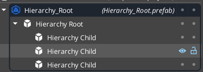
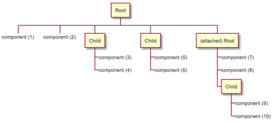
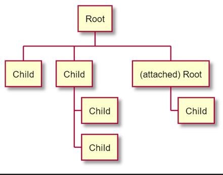

# rfc-net-20211005-2
* Intake issue: https://github.com/o3de/sig-network/issues/5

### Summary:

Game designers often create game and player objects out of several entities, often in a parent-child relationship, such as a player object consisting of a main player body entity with child entities representing various player abilities and weapons. Entities of these game objects are often dependent on one another, based on transform or game logic.

In multiplayer environment, group of such entities need to do the following:
- spawn in the correct order on multiplayer clients, with parent entities starting first, and child entities spawning last
- and process player input together as a single unit, instead of processing and sending their inputs as separate entities.


### What is the relevance of this feature?

#### Challenge: Parent – Child Activation Order of Network Entities

On a server, prefabs spawn entities from parent to child entities. On clients, however, these entities may be created out of order as network packets come in. For example, a child entity may be activated before the parent entity; this may lead to child entities having incorrect world positions. Due to the random nature of network packet ordering, this will be a source of hard to reproduce and identify bugs.

Given the following prefab structure:
- Test Entity 1 is the root parent 
- Test Child 2 is the child of Test Entity 1 
- Test Child 3 is the child of Test Child 2

These entities may be created on a multiplayer client out of order. Here is an example output of a debug component that prints activation order to the log:
```
(DebugNetwork) - entity [Test Child 2] activated
(DebugNetwork) - entity [Test Entity 1] activated 
(DebugNetwork) - entity [Test Child 3] activated
```

Whereas the correct order should be Test Entity 1, followed by Test Child 2 and then Test Child 3.

**Goal**: O3DE Networking provides a solution to spawn parents and child entities in the right order, where parents are activated before their child entities.

#### Challenge: Combined Input Processing of Entities

Once entities are created in the correct order another, more advanced, challenge will appear on both server and clients: a player entity often needs to process player input commands (such as movement commands). In the context of a multiplayer game, that means saving processed inputs to a buffer. This buffer acts as a recent history of player inputs and is used by features such as local prediction for player movements and actions. Let us suppose that soon after, a game designer adds a child entity that represents a jetpack and describes the amount of fuel left in the jetpack.

Now it would be convenient to store processed player input for both the main player entity and the child jetpack entity; this way if a network feature needs to know the player's state a few moments in the past, it can find the state of both the main player entity and the jetpack entity. For example, a player may have moved using the jetpack. If one only considers the movement, bugs will be introduced if the game logic does not take into account the state of the jetpack's fuel across time.

_Bug Example 1_: a player moves forward using a jetpack; the jetpack fuel amount is now at half. However, the locally predicted forward movement was incorrect and so the server sends the client a correction. The client receives the correction and re-calculates using the stored player input data but ignores the state of the jetpack entity. This ends up using the remaining jetpack fuel while re-calculating the player’s movement after the correction. The bug is now a sudden drop in jetpack fuel at seemingly random times.

_Bug Example 2_: one of the player abilities is a shield that is drained when attacked by other players. On a server, whenever a player firing action is received the world is rolled back in time to when the shot occurred on the player's application. The target player is moved back into the position, but their shield strength was not rolled back, as it was not included in input processing by mistake. Now, the damage calculation may be incorrect if shield amount is different between these two moments in time.  

**Goal**: O3DE Networking provides a solution where a defined hierarchy of entities are processing input for multiplayer systems as one group.

### Feature and Technical design description:

As mentioned earlier, there are two challenges to solve: 
1. the order of entity activation on clients and 
2. combined input processing for the entire entity hierarchy.


There is one additional variation that spans both challenges: dynamic versus edit-time prefabs. That is, a user might wish define their hierarchy in the Editor to get started but will soon find a reason to modify that hierarchy at runtime by attaching new entities or removing exists entities. For example, this could be a game spawning a new entity or a prefab describing a player weapon and attaching it to player’s root entity, or it could removing some vehicle parts due to in-game damage. Either way, in practice, both dynamic and bake time hierarchy ought to be supported.



The above diagram is a visual example of a prefab that contains 4 entities: 1 of them is the root, and 3 others are children. Because Hierarchy Child entities are linked via their Transform component as children of Hierarchy Root, that are visually shown to belong to Hierarchy Root. (This UI already exists in the Editor.)

At activation time, the hierarchical root entities are activated before hierarchical child entities. Therefore, these child entities can notify their root of their activation.

By the time the entire prefab has been activated, Hierarchy Root component will have all its relevant children listed. That means, when the root entity is processing its input (_NetBindComponent::ProcessInput_), it can also invoke processing on all attached hierarchical children. Specifically, a Network Binding component at the top-level root of the hierarchy does the following 3 steps in the descending order:

1.	Process inputs of the components attached to the hierarchy root entity
2.	Then process inputs of Network Binding components to any hierarchical children
3.	And finally process inputs of any hierarchical lower level roots in the hierarchy

(There will be some limit to the supported levels of recursions. Likely specified by a AZ_CVar.)
Here is a visual diagram of the order. _Component (1)_ gets its input processed first and _component (10)_ last.



Note: an attached root is a root that was once autonomous but later attached to another hierarchy. It is more likely to occur at runtime than Editor time, for example, when attaching a player to a vehicle. In such a case, a player prefab would be created with a hierarchy root component at the top entity and be autonomous on its own during the game but occasionally attaching itself to an autonomous vehicle prefab when needed.



When a hierarchical child is activated on the server, it can find its immediate parent by looking up its transform parent. Network Transform component on the same entity will transmit this information to clients, where this entity’s activation will be delayed until its hierarchical parent has been activated on the parent. Once activated on a client, Hierarchical Child component may need to walk up multiple transform parents to find its root and connect itself for input processing.
Hierarchical component will have Editor component toggles and API for disable/enable of hierarchy and input processing. This way users can customize their structures and it allows for helpful debugging while developing and testing this solution.
In summary, two new components will be introduced:

- Hierarchical Root component 
no network properties (depends on the data in Network Transform component)
- Hierarchical Child component 
"include in input processing" toggle
no network properties (depends on the data in Network Transform component)

Network Binding component will be modified to reference these components when inspecting child entities, as connected via Transform components.


#### Additional Background / Terminology

**Terminology**
- Parent entity – in O3DE it commonly means an entity whose transform determines other entities’ transforms
- Child entity – an entity whose transform depends on a transform of its parent entity
- Hierarchy of entities – a group of entities united by their parent-child relationships
- Transform – a combination of a position, orientation, and scale
- Local prediction – a technique in multiplayer to predict player actions without waiting on the server to tell the player how they will move
- Server correction – when local prediction on a client goes wrong, the server will let the client know of the correct result


### What are the advantages of the feature?

- The best presentation of hierarchy in O3DE engine is found in the Editor and in prefab is that of Transform components. A transform component can have a parent and/or children entities, all link by their Transform components. This solution leverages and builds on this UI by using Transform parent-child relationship as the basis for hierarchical entities.
- This is a straightforward hierarchical implementation using components and existing parent-child relationship of Transform component.

### Implications / Considerations

- This is a straightforward hierarchical implementation using components and existing parent-child relationship of Transform component.
- All hierarchical connections point from transform children up to transform parents. This way we avoid the danger of creating loops of hierarchical structures by using battle-tested checks within Transform component.
- Whenever an entity is detached, destroyed or moved to a new entity, this change can be detected by hierarchical components and adjusted accordingly.
- In practice, the root of a prefab will be the root of hierarchy as well. If a user wishes to add a new child to this hierarchy, they will add their new entities and/or prefabs to the root entity or one of its child entities that have either hierarchical root or child components.
- In order to support multiple levels of hierarchy, Network Hierarchy Child component needs to keep track of two entities: its immediate parent and its top-level root. The root can be calculated at the activation of entities, by walking up the parent-child relationship until the root is found. Its immediate parent can be looked up in Network Transform component on the same entity.
- Care must be made to avoid unnecessary walking up the entities on game ticks. It should be limited to entity activation only, or when an entity is moved or removed.
- The most critical path is **ProcessInput** method of NetBindComponent class. **ProcessInput** gets called every time any player input is detected on clients and is executed on server when applying player input. In practice it occurs every frame on clients, and multiple times a frame on servers. It is a hot execution path in multiplayer code. The calculation of hierarchical members must be kept outside of this logic. Given that parent changes can be signed up for via AZ::Events, hierarchy updates would occur only when a parent-child relationship changes in the hierarchy.


### How will this be implemented or integrated into the O3DE environment?
The implementation will be placed inside Multiplayer gem. The logic will reside primarily in 2 new components outlined above: Network Hierarchy Root and Child components.

### Are there any alternatives to this feature?
Another possible approach is *Arbitrary Hierarchy of Entities*.

This approach is largely the same as the recommended solution but one major difference: instead of depending on Transform component, it allows for full freedom of assigning of parent entities within a hierarchy. In this case, it is possible to either skip Transform parents or parent to an entity from a different prefab and avoid Transform parent-child structure entirely, even potentially going in the opposite direction of Transform parent-child connections.

#### Rationale for NOT Recommending This Solution

- This much flexibility makes it too easy to get oneself in a bad state, especially at runtime, where one could form a loop within a hierarchy while attaching multiple hierarchies.
- It would be unclear what should be activated first on clients. Likely, it would require an additional activation pass over involved entities, which would add too much complexity to the logic in multiple other related network systems.
- The relationship would be hard to visualize in the Editor since the current UI can only be based on Transform parent-child relationship.

### How will users learn this feature?
- This feature will be discoverable through Network Hierarchy components and documentation.

### Are there any open questions?
- If a filtering system filters out a hierarchical root, should the entire hierarchy be filtered out?
